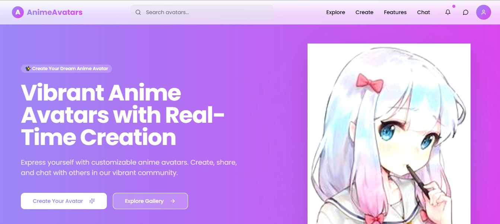

# AnimeAvatars



**Vibrant Anime Avatars with Real-Time Creation**

AnimeAvatars is a web application that lets users express themselves by creating fully customizable anime avatars. With real-time creation tools, an interactive gallery, and community chat features, users can design unique avatars, share them, and connect with others.

This project was built using **[Lovable](https://lovable.dev/)** — an AI-powered development platform — along with Vite, React, Tailwind CSS, and TypeScript.  
It was initially generated with the help of AI, but I actively solved multiple development challenges myself, ensuring smooth functionality, bug fixes, and improved user experience.

---

## ✨ Features

- **Real-Time Avatar Creation** – Customize facial features, hairstyles, colors, and accessories instantly.
- **Vibrant UI** – Beautiful gradient design powered by Tailwind CSS.
- **Search & Explore** – Browse through a gallery of user-created avatars.
- **Community Chat** – Interact with others in a friendly anime-focused space.
- **Responsive Design** – Works on desktop, tablet, and mobile devices.
- **Fast & Modern** – Built with Vite and TypeScript for optimal performance.
- **Lovable + AI Development** – Created with AI assistance, refined with human problem-solving.

---

## 🛠 Tech Stack

- **Development Platform**: [Lovable](https://lovable.dev/)
- **Frontend Framework**: [Vite](https://vitejs.dev/) + [React](https://react.dev/) + [TypeScript](https://www.typescriptlang.org/)
- **Styling**: [Tailwind CSS](https://tailwindcss.com/)

---

## 📦 Installation & Setup

Clone the repository and install dependencies:

```bash
git clone https://github.com/your-username/anime-avatars.git
cd anime-avatars
npm install
````

Run the development server:

```bash
npm run dev
```

Build for production:

```bash
npm run build
```

Preview the production build:

```bash
npm run preview
```

---

## 🚀 Deployment

This project is pre-configured for **Netlify** deployment via the `netlify.toml` file.

To deploy:

1. Push your code to GitHub.
2. Link your repository in Netlify.
3. Deploy — your app will be live within minutes.

---

## 📂 Project Structure

```
.
├── public              # Static assets
├── src                 # Application source code
├── components.json     # Reusable UI components
├── index.html          # Main HTML template
├── tailwind.config.ts  # Tailwind CSS configuration
├── vite.config.ts      # Vite configuration
├── netlify.toml        # Netlify deployment config
└── package.json        # Project metadata & scripts
```

---

## 🤝 Contributing

Contributions are welcome!
Please fork the repository and submit a pull request with clear commit messages.

---

## 📄 License

This project is licensed under the MIT License.

---

## 🌐 Live Demo

[Live Preview](https://preview--vibrant-anime-avatars.lovable.app/)

